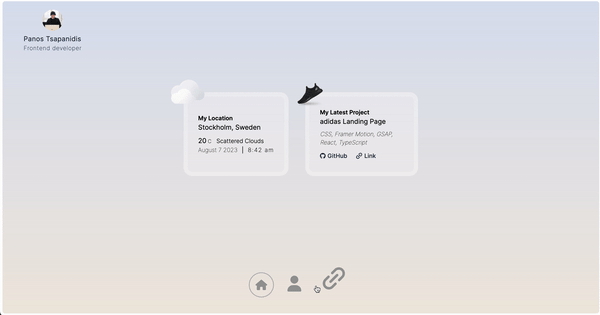
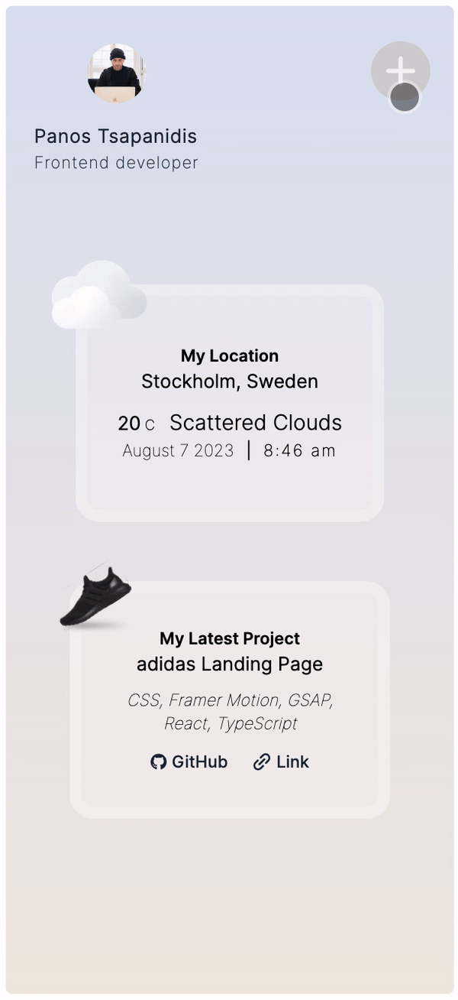

# 

 

# Personal Portfolio

My portfolio website was built using _Next.js 13_, _Tailwind CSS_, and _TypeScript_. It consists of three sections, **Home** page, **About** page and **Links** page and it's responsive.

## Demo

Here is a working live demo I've hosted on Vercel: https://portfolio-v2-lyart-sigma.vercel.app/

 

## Site

### Home Page

I wanted to make use of a 3rd-party API so I chose _OpenWeather's API_ to show the weather of the location I live in. The second card shows the latest project I've built.

### About Page

In this page I present all the information that's relevant to my career as a software developer. From my education, to the tech stack I'm familiar with as well as information about some of the projects I've built.

### Links Page

It contains 3 links (_CV pdf_, _GitHub_, _LinkedIn_) and I've built a carousel that the user can drag/swipe to click on a link. The carousel is built with pure _CSS_.

 

## Interactivity

### Desktop Menu

The desktop menu works similarly to Mac OS's menu and is powered by _Framer Motion_.

### Mobile Menu

A hamburger menu is used on mobile views for navigation.

### Links Carousel

The user drags/swipes sideways to go to the next slide of the carousel.

 

## Built with

- **CSS**
- **Framer Motion**
- **Next.js**
- **OpenWeather API**
- **Tailwind CSS**
- **TypeScript**
